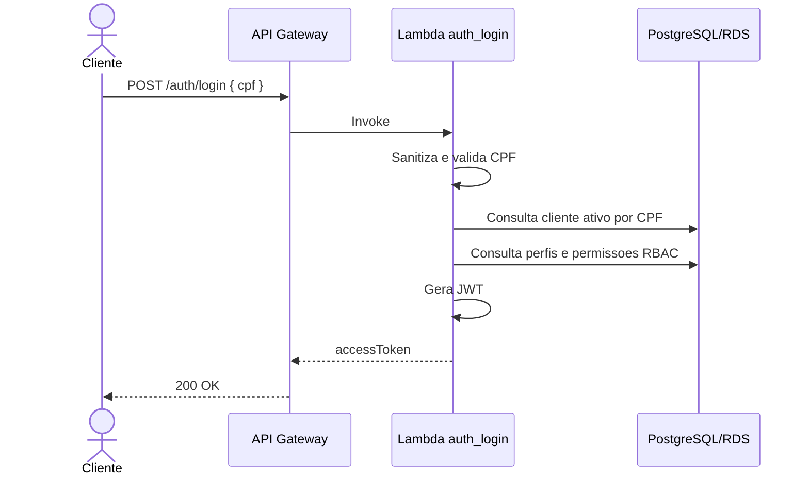
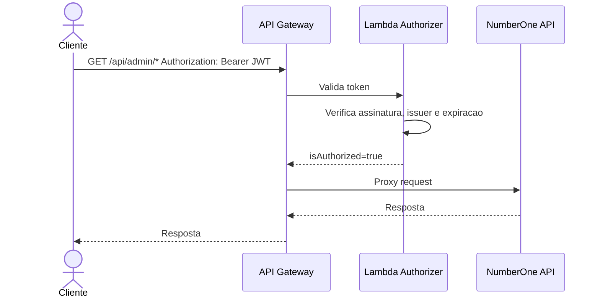
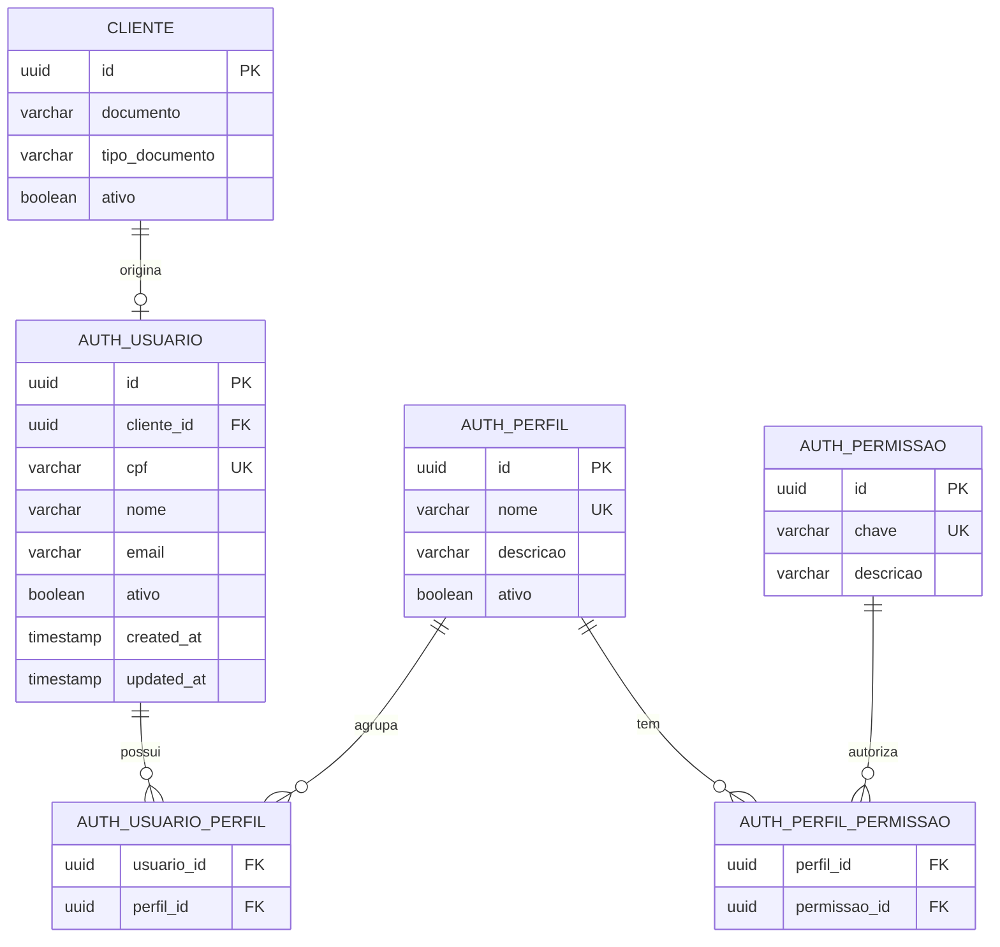

# PosTech15SOAT - NumberOne App Auth

Repositório de autenticação serverless do Tech Challenge Fase 3 da organização `PosTech15SOAT`.

Este projeto centraliza a autenticação por CPF, o modelo RBAC, a emissão de JWT, a validação de tokens via Lambda Authorizer e o provisionamento do API Gateway usado para proteger as rotas sensíveis da aplicação NumberOne.

## Objetivo

Atender à frente de autenticação da Fase 3:

- Validar CPF do cliente.
- Consultar existência e status do cliente na base PostgreSQL.
- Emitir JWT para consumo das APIs protegidas.
- Validar JWT no API Gateway usando Lambda Authorizer.
- Definir modelo RBAC com usuário, perfil e permissão.
- Provisionar Lambdas e API Gateway via Terraform.
- Documentar arquitetura, DER, ADRs e execução.

## Stack

- AWS Lambda
- Amazon API Gateway HTTP API
- PostgreSQL/RDS
- Python 3.12
- Terraform
- GitHub Actions
- JWT HS256
- CloudWatch Logs

> A estratégia inicial usa HS256 para manter compatibilidade com a aplicação principal, que já valida JWT por segredo compartilhado. A evolução recomendada é RS256/JWKS.

## Estrutura

```text
src/
  auth_login/          Lambda pública de autenticação por CPF
  authorizer/          Lambda Authorizer para validação de JWT
  shared/              Código compartilhado de CPF, JWT, banco e respostas HTTP
db/
  migrations/          Migrations SQL do modelo RBAC
infra/                 Terraform para Lambdas, API Gateway, IAM e variáveis
docs/
  adr/                 Architecture Decision Records
  diagrams/            Diagramas Mermaid
  openapi.yaml         Contrato OpenAPI do login
  postman/             Collection Postman
  rfc/                 RFCs técnicas
tests/                 Testes automatizados
.github/workflows/    CI e deploys
scripts/               Scripts de build local/CI
```

## Fluxo de Autenticação



## Fluxo de Autorização



## Modelo RBAC

O modelo RBAC mantém usuários de autenticação vinculados ao cliente da aplicação principal.



## Endpoints

### Login por CPF

```http
POST /auth/login
Content-Type: application/json
```

Request:

```json
{
  "cpf": "12345678901"
}
```

Response:

```json
{
  "accessToken": "jwt",
  "tokenType": "Bearer",
  "expiresIn": 3600
}
```

### Rotas protegidas

```text
/api/admin/{proxy+}
/api/public/{proxy+}
```

Essas rotas passam pelo Lambda Authorizer antes de serem encaminhadas para a aplicação principal. A exceção anônima é `/api/public/health`.

Nas rotas protegidas, o API Gateway encaminha para a aplicação principal:

```text
X-Authenticated-Subject
X-Authenticated-Customer-Id
X-Authenticated-Status
X-Authenticated-Roles
X-Authenticated-Permissions
X-Correlation-Id
```

## OpenAPI e Postman

- [OpenAPI](docs/openapi.yaml)
- [Postman Collection](docs/postman/numberone-auth.postman_collection.json)

## Execução Local

Instalar dependências:

```bash
python -m venv .venv
source .venv/bin/activate
pip install -r requirements-dev.txt
```

Rodar testes:

```bash
pytest
```

Gerar Lambda Layer:

```bash
./scripts/build-lambda-layer.sh
```

Validar Terraform:

```bash
cd infra
terraform fmt -check
terraform init -backend-config="bucket=<TF_STATE_BUCKET>" -backend-config="region=us-east-1"
terraform validate
```

## Variáveis de Ambiente das Lambdas

| Variável | Descrição |
| --- | --- |
| `DB_SECRET_ARN` | ARN do Secrets Manager com credenciais do PostgreSQL. |
| `JWT_SECRET_ARN` | ARN do Secrets Manager com segredo JWT. |
| `JWT_SECRET` | Fallback local para segredo JWT. |
| `JWT_ISSUER` | Issuer esperado nos tokens. |
| `JWT_AUDIENCE` | Audience esperada nos tokens. |
| `JWT_EXPIRATION_SECONDS` | Tempo de expiração do access token. |

Formato esperado do segredo do banco:

```json
{
  "host": "rds-endpoint",
  "port": 5432,
  "dbname": "numberone",
  "username": "numberone",
  "password": "senha"
}
```

## Terraform

O Terraform provisiona:

- IAM roles das Lambdas.
- Lambda `auth_login`.
- Lambda `authorizer`.
- Lambda Layer de dependências Python.
- API Gateway HTTP API.
- Login e health públicos; demais rotas protegidas.
- Headers `X-Authenticated-*` e `X-Correlation-Id` para a aplicação principal.
- CloudWatch Log Groups.
- Access logs JSON do API Gateway.
- Permissões de invoke entre API Gateway e Lambdas.

Arquivos principais:

```text
infra/main.tf
infra/variables.tf
infra/outputs.tf
```

Documentação específica: [infra/README.md](infra/README.md).

## Documentação

- [DER da autenticação](docs/diagrams/auth-rbac-er.md)
- [Fluxos de autenticação e autorização](docs/diagrams/auth-flow.md)
- [ADR-001 - Lambda e API Gateway](docs/adr/ADR-001-lambda-api-gateway.md)
- [ADR-002 - Estratégia JWT](docs/adr/ADR-002-jwt-strategy.md)
- [ADR-003 - Modelo RBAC](docs/adr/ADR-003-rbac-model.md)
- [ADR-004 - Acesso ao RDS e Secrets Manager](docs/adr/ADR-004-lambda-rds-secrets.md)
- [ADR-005 - Roteamento do API Gateway](docs/adr/ADR-005-api-gateway-routing.md)
- [RFC-001 - Desenho da autenticação](docs/rfc/RFC-001-authentication-design.md)
- [TODO da frente de autenticação](TODO.md)

## Status

Implementação base da frente de autenticação criada. Itens que dependem da integração com os demais repositórios:

- Confirmar URL pública/privada da aplicação principal em Kubernetes.
- Confirmar estratégia final de segredo JWT com o time da aplicação principal.
- Confirmar dados e permissões de acesso ao RDS.
- Criar ambientes `homolog` e `prod` no GitHub.
- Configurar secrets/vars do GitHub Actions.
