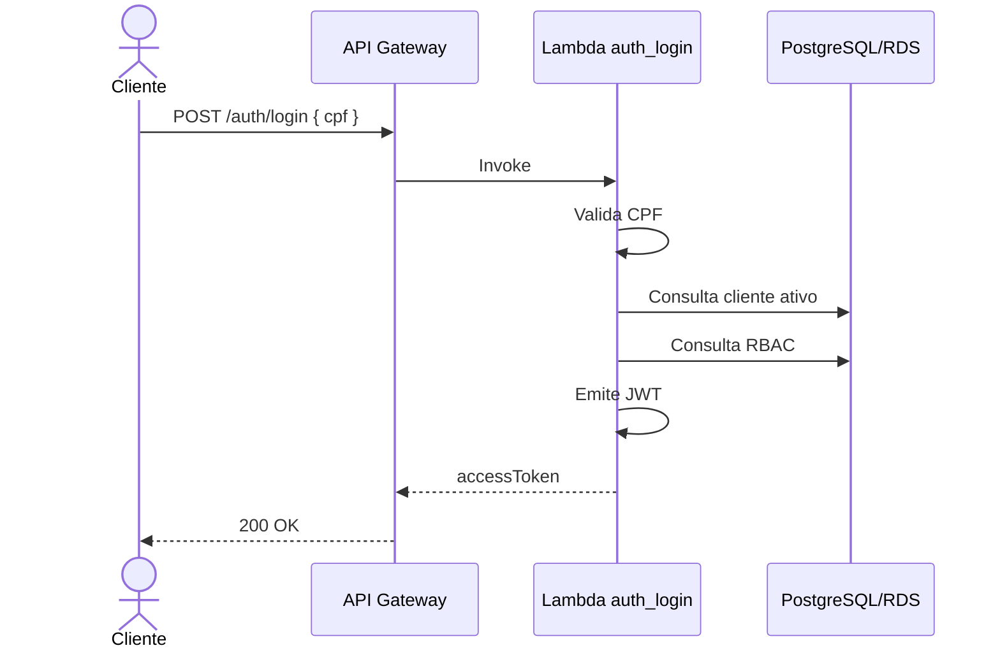
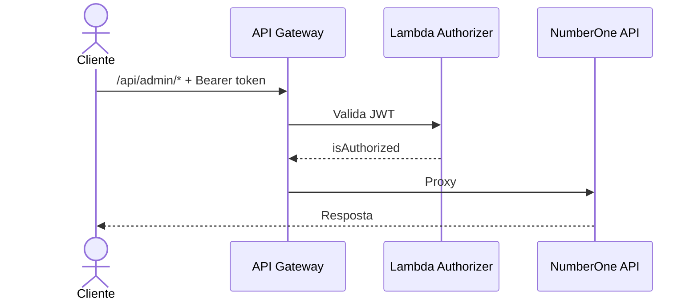

# Fluxos de Autenticacao e Autorizacao

## Login por CPF

```mermaid
sequenceDiagram
    actor Cliente
    participant APIGW as API Gateway
    participant Login as Lambda auth_login
    participant DB as PostgreSQL/RDS

    Cliente->>APIGW: POST /auth/login { cpf }
    APIGW->>Login: Invoke
    Login->>Login: Valida CPF
    Login->>DB: Consulta cliente ativo
    Login->>DB: Consulta RBAC
    Login->>Login: Emite JWT
    Login-->>APIGW: accessToken
    APIGW-->>Cliente: 200 OK
```

## Consumo de API protegida

```mermaid
sequenceDiagram
    actor Cliente
    participant APIGW as API Gateway
    participant Authz as Lambda Authorizer
    participant API as NumberOne API

    Cliente->>APIGW: /api/admin/* + Bearer token
    APIGW->>Authz: Valida JWT
    Authz-->>APIGW: isAuthorized
    APIGW->>API: Proxy
    API-->>Cliente: Resposta
```
