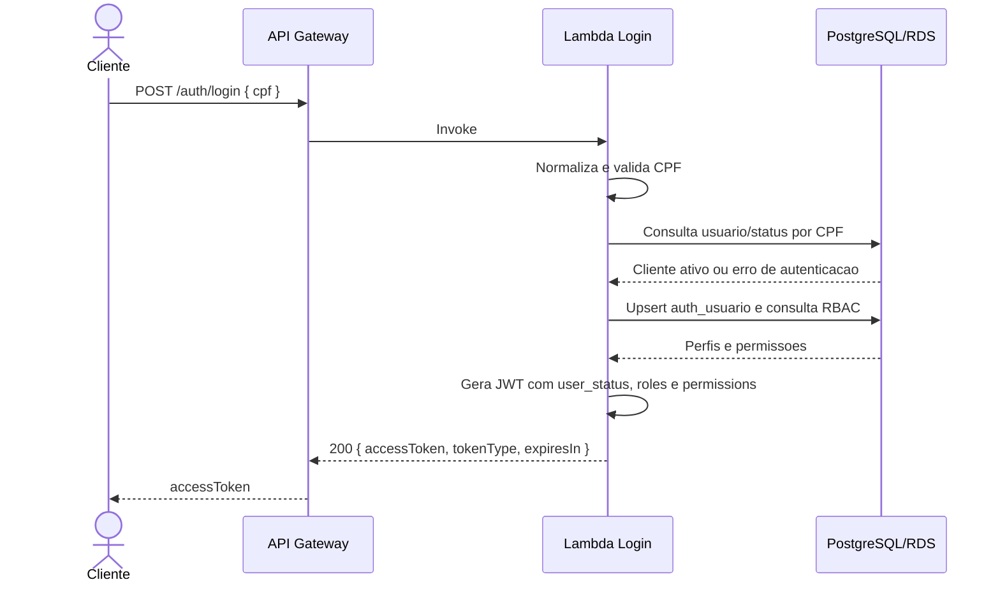
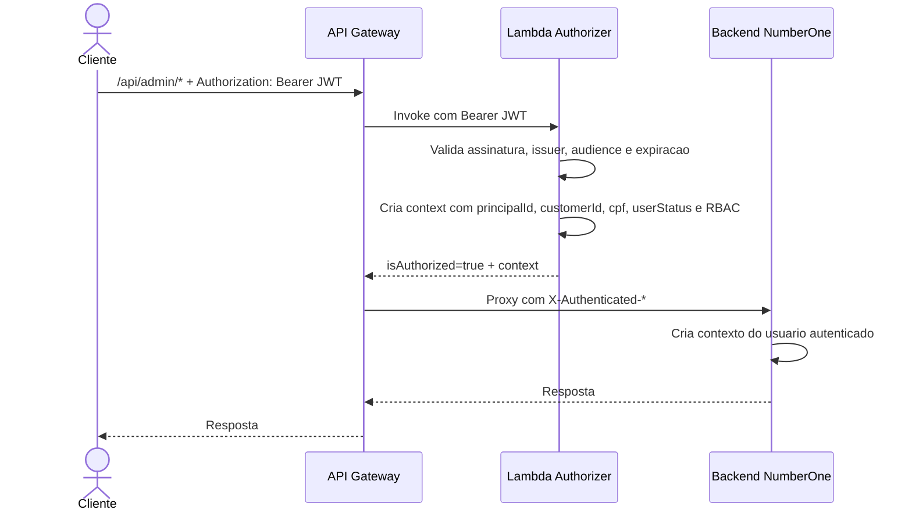

# Diagrama de Sequencia - Autenticacao

Este diagrama consolida o fluxo final da frente de autenticacao: login por CPF,
emissao do JWT e validacao de rotas protegidas pelo Lambda Authorizer.

## Parte 1 - Login por CPF

## Parte 2 - Rota protegida

