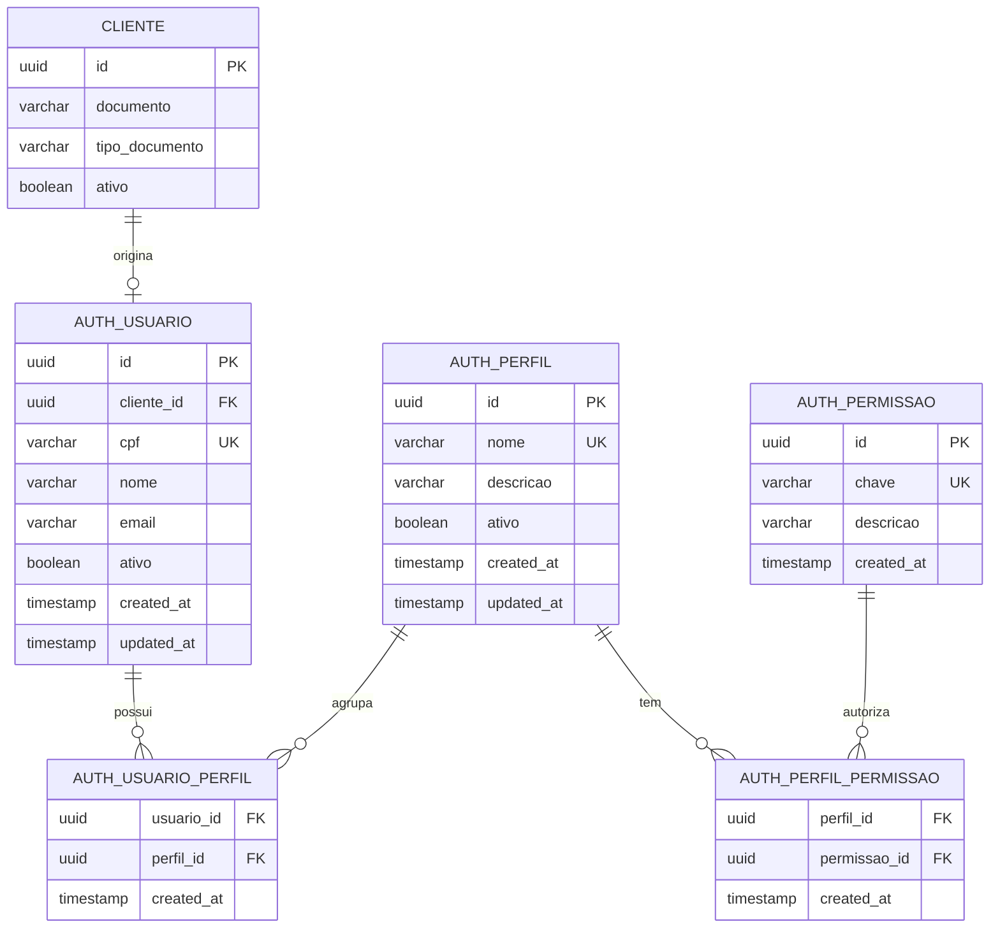

# DER - Autenticacao RBAC

```mermaid
erDiagram
    CLIENTE ||--o| AUTH_USUARIO : "origina"
    AUTH_USUARIO ||--o{ AUTH_USUARIO_PERFIL : "possui"
    AUTH_PERFIL ||--o{ AUTH_USUARIO_PERFIL : "agrupa"
    AUTH_PERFIL ||--o{ AUTH_PERFIL_PERMISSAO : "tem"
    AUTH_PERMISSAO ||--o{ AUTH_PERFIL_PERMISSAO : "autoriza"

    CLIENTE {
        uuid id PK
        varchar documento
        varchar tipo_documento
        boolean ativo
    }

    AUTH_USUARIO {
        uuid id PK
        uuid cliente_id FK
        varchar cpf UK
        varchar nome
        varchar email
        boolean ativo
        timestamp created_at
        timestamp updated_at
    }

    AUTH_PERFIL {
        uuid id PK
        varchar nome UK
        varchar descricao
        boolean ativo
        timestamp created_at
        timestamp updated_at
    }

    AUTH_PERMISSAO {
        uuid id PK
        varchar chave UK
        varchar descricao
        timestamp created_at
    }

    AUTH_USUARIO_PERFIL {
        uuid usuario_id FK
        uuid perfil_id FK
        timestamp created_at
    }

    AUTH_PERFIL_PERMISSAO {
        uuid perfil_id FK
        uuid permissao_id FK
        timestamp created_at
    }
```
